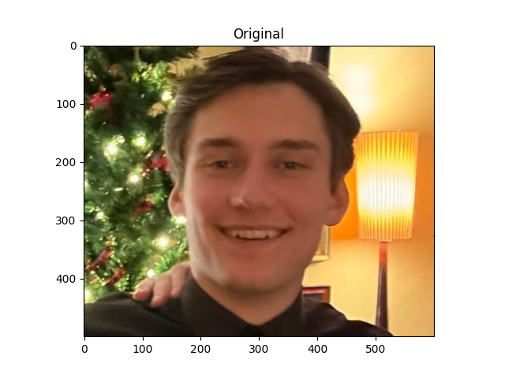
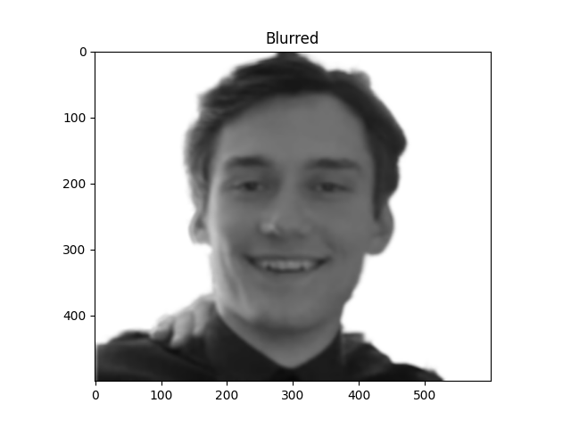
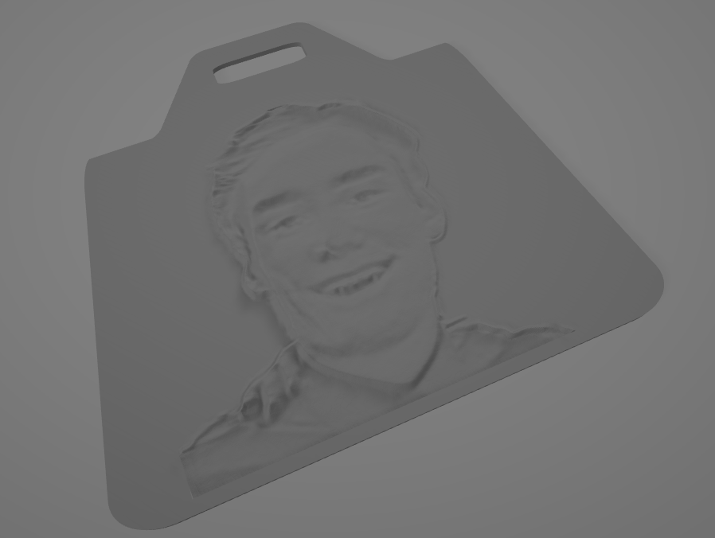

# Sink-scraper builder
-----------------------------------
### Builds an STL model of a sink-scraper with a model corresponding to a picture of a person in the center. 
OBS: Currently only accepts 500x600 image. 

To run, download and open "Anaconda promt" before running in the terminal:
```
python -m sinkscraper [-h] [-sh] [-sa] [file]
```

-sh flag shows intermediate pictures

-sa flag saves the intermediate picture produced after performing all image modifications

python -m sinkscraper -h prints this information

-----------------------------------

Known "good" configuration for parameters - feel free to modify in parameters.json:

> BLUR : 7,                             # The amount of blur to introduce on the picture - helps with smoothing

> MIN_PICTURE_HEIGHT : 0.2,             # The minimum thickness of the image at the darkest place (grayscale-value 0)

> MAX_PICTURE_HEIGHT : 4.8,             # The maximum thickness of the image at the brightest place (grayscale-value 255)    

> LAYERS : 255,                         # The amount of layers that the colors map to. 255 gives a distinct layer for each grayscale-value - lower values makes result more "blocky"  

> CUTOFF : 255,                         # A cutoff value for layers, meaning that layers do not exceed this value - some result looks better with a lower value. Note that a lower value makes it so that MAX_PICTURE_HEIGH is never reached. 

> TARGET_CONTRAST_BRIGHTNESS : 68       # A target for the brightness of the picture - used for contrast. 


The board is 1.6 units high as standard

I've had a lot of success in printing these models on my 3D printer, but since I've only been printing other people so far, I will not show any of the results here :-)

-----------------------------------
## Example

Original image:



Image after applying resnet, FBA matting and other picture processing:



Final stl:


